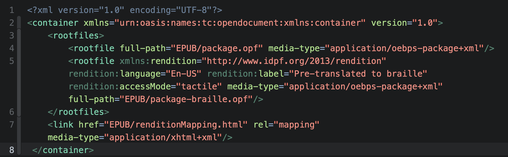

- 下載[範本EPUB檔案](https://github.com/dpublishing/epub-a11y-samples/raw/main/a11y_pamphelet.epub)
- 可使用DAISY提供的[ACE檢查器](https://daisy.github.io/ace/getting-started/ace-app/#where-can-i-download-the-ace-app)開啟檢視
- ACE檢查器[中文化](https://github.com/dpublishing/ace)已經完成，待受DAISY正式採用後新版即會支援中文
- 另提供錯誤的[負面範本](https://github.com/dpublishing/epub-a11y-samples/raw/main/a11y_pamphelet_allerrors.epub)，內有ACE的各種規則說明。

# 數位出版中的Accessibility

### Accessibility的翻譯與定義

Accessibility，在英文的世界裡，因為這個單字太長，常會被縮寫成a11y；在中文的世界裡，則沒有公定的譯法，有譯為「近用性」、「可及性」，也有人倡議譯為「親和力」。就其文義，放在數位出版的脈絡下，是讓任何障礙者，得以具備和正常人一樣的能力存取內容。

舉個例子，一本印刷書對於盲人而言，就只是一疊紙而已。但電子書因為內容是資料化的文字，且具有結構，就可以透過各種輔助科技變成可以閱讀的內容。

所以，為求在文字上理解，數位出版聯盟將Accessibility翻譯成「無障礙輔助性」，應用在EPUB規格與相關文件、檢查器程式中文化上，以讓使用者輕易理解。

### 數位出版的數位化媒體與無障礙規格

數位出版在2021年現在，所使用的數位化媒體大致上底定。新聞與雜誌朝向網站轉型、書籍出版則以EPUB格式電子書透過網站銷售。無論網站還是EPUB格式電子書，其底層都是基於網頁技術：HTML、CSS、Javascript等，這些技術共享一系列已經相當完善的無障礙指引和技術，雖然要多花一些力氣來對應，但不大會遇到不知道怎麼辦的狀況。

制定網頁技術的國際組織W3C成立於1994年，而在1996年秋季時[^2]，就已成為W3C的計畫之一，網頁無障礙輔助性促進會（Web Accessibility initiative, WAI）現在依然持續運作。主要推動兩項標準：

- 網頁內容無障礙輔助性準則（Web Content Accessibility Guidelines, WCAG）：供「內容網頁」使用，提供無障礙、人人都可以直接或透過輔助科技使用的內容。目前版本為[2.1版](https://www.w3.org/TR/WCAG21/)，正在進行[2.2版](https://www.w3.org/TR/WCAG22/)的改版作業。

- 無障礙多樣化網際網路應用程式（Accessible Rich Internet Applications, ARIA）：網頁不僅是「內容網頁」，現在大多數網頁都如應用程式可以互動運作，就需要更進一步的標準，ARIA為HTML元素提供了角色、特性、狀態，使輔助科技能夠進一步地協助使用者操作。目前版本為[1.1版](https://www.w3.org/TR/wai-aria-1.1/)。

這兩項標準是供網頁所使用。台灣過往由行政院研考會，後來國發會改制後，將網頁無障礙業務交給了國家通訊傳播委員會（NCC），維護與WCAG同步的「[網站無障礙規範](https://accessibility.ncc.gov.tw/Accessible/Category/68/1)」。

電子書則有些不同。

### 電子書的無障礙規格

在EPUB之前，全球的DAISY Consortium正如其英文名稱：Digital Accessible Information SYstem，數位無障礙資訊系統，成立於1996年，針對數位化的書籍、期刊、有聲書、數位文字等，提供標準化的規格來製作通用的無障礙數位內容。

EPUB的前身OEBPS制定於1999年，但未能廣泛商轉；直到2007年隨著Amazon推出Kindle生態圈，才轉身改名為EPUB並改版為2.0版。到了2012年改版3.0時，與DAISY格式合併。這項合併代表了去差異化──閱讀無障礙者和有閱讀障礙者，都使用相同的電子書格式。

從出版商的角度來看，對於EPUB 3的種類認識會是這樣：

- Reflow重排：適合文字書，如：小說，文字會按照載具及設定重新排列；
- Fixed Layout固定版面：適合漫畫、雜誌等版面複雜的內容；
- Media Overlay媒體覆蓋：具有文字與聲音同步播放，適合童書。

其中媒體覆蓋就是來自DAISY的一種無障礙呈現方式。

因為DAISY在國內並未受到廣泛採用，所以在國外的特殊教育和社會福利現場，看到的EPUB就是過去DAISY格式的應用方式，如：

- 使用多重內容釋義（Multiple Rendition），也就是一本書中包含兩種呈現形式，其中一種是盲文版。
- 內容包含有聲音檔，文字內容僅有章節開頭與導覽目錄，作為有聲書提供。

然而，隨著輔助科技的進步，像是透過文字轉換語音（Text to speech, TTS）可以朗將文字書中的文字轉成語音；或者透過作業系統連結藍牙裝置可以盲文（Braille）提供[^1]。一般人能閱讀的EPUB電子書，也可以讓閱讀障礙者閱讀，比起印刷書更為「通用（universal）」。

為達成這樣的目標，要做到些什麼事呢？

### 歐盟無障礙法的推進

2019年四月，歐盟通過[Directive (EU) 2019/882](https://eur-lex.europa.eu/legal-content/EN/TXT/?uri=uriserv:OJ.L_.2019.151.01.0070.01.ENG)對產品與服務的無障礙規定，又被稱為「歐盟無障礙法（The European Accessibility Act, EAA）」。其中包含了對電子書、電子書閱讀程式、販售網站的無障礙要求。2022年中歐盟各會員國需要執行；2025年成為強制狀態。

所以EPUB格式電子書為了合乎該法案，除了基本上內容符合WCAG的A等級至AA等級外，還需要符合一些額外專屬於EPUB格式的規定。同時，為了介接販售網站，將是否合規以及具有哪些無障礙輔助功能得以明示（無論在電子書店的產品頁上，還是圖書館的借閱頁面上），需要一份無障礙輔助性的詮釋資料（Accessibility metadata）來進行宣告。

同時，既有的，上述特化的EPUB檔案，可能不符合通用的無障礙輔助性規定，但對特定族群做了最佳化，也該透過這方式宣告。

### W3C的無障礙輔助性規格

無障礙輔助性對EPUB而言，一向是重要的功能，在IDPF時期就已經有相當多的輔助規格作為參考。而在IDPF合併到W3C時，也有一份會員提案的文件[EPUB無障礙輔助性1.0](https://dpublishing.github.io/epub-specs-tc/epub32/epub-accessibility.html)。然而隨著歐盟無障礙法的通過，這份文件上的內容就因適法需求而有強制性，所以改版到[1.1版](https://dpublishing.github.io/epub-a11y-tc/epub-a11y-11.html)時成為正式的W3C規格。

那麼，主要要求哪些事情呢？

對於EPUB出版品而言，在EPUB無障礙輔助性1.1中，要求了在包裝文件（即OPF檔案中）加入無障礙詮釋資料，說明內容如何呈現，有哪些輔助功能和可能的危害供機器或販售平台讀取，另外也提供一份給人讀的摘要。

同時也要求內文至少符合WCAG 2.0 A等級的規定，最好達到AA等級。

如果是供教育或者會與印刷書一齊使用，像是老師會要學生同時翻到第150頁這樣的狀況，建議將印刷書的頁碼，以頁面列表（Page-list）的方式加入電子書中，並且註明分頁的來源（如初版、二版、精裝版、平裝版等）。

以及對於文字與聲音同步播放的媒體覆蓋（Media Overlay）EPUB的要求。儘管像Apple Books、Google Play Books、Rakuten Kobo等國際平台支援已經完善，但並非所有本土平台都支援，且在數位出版聯盟前幾年制定的EPUB 3製作指引中都尚未推薦使用這項功能，所以國內的書較少。但若要將這樣的繪本、童書送到全世界販售，就得多加注意這幾項無障礙原則。

本規格也提供了認證相關的詮釋資料，出版商可以將書給第三方或者自行進行無障礙認證，將符合的規格與等級、認證方的資料包含在書中，以確保公信。

前述由DAISY而來的特化無障礙數位內容，這裡稱為「最佳化（Optimized）的出版品」。是針對特殊需求來做最佳化，但反而無法達到規格的規定。所以需要另外註明這些資訊。最後針對遞送平台，如圖書館和電子書店提出要求；以及一些隱私和安全考量。

以上是EPUB無障礙輔助性規格的內容。同時還有一些隨附的文件，說明如下：

- [EPUB無障礙輔助技巧 1.1](https://dpublishing.github.io/epub-a11y-tc/epub-a11y-tech-11.html)：和WCAG一樣，無障礙標準主要說明「要做什麼？」而將「如何達成？」的技術部份放到隨附的技巧（technique）文件進行說明。
- [EPUB無障礙輔助性常見問題](https://dpublishing.github.io/epub-a11y-tc/a11y-faq.html)：常見問題集。
- [EPUB無障礙輔助性與歐盟無障礙法之對應關係](https://dpublishing.github.io/epub-a11y-tc/epub-a11y-eaa-mapping.html)：針對歐盟無障礙法電子書部分逐條說明如何對應。

此外，針對較難提供無障礙輔助的固定版面EPUB，工作小組也起草了一份「[EPUB Fixed Layout無障礙輔助性](https://dpublishing.github.io/epub-a11y-tc/ED-epub-fxl-a11y-20211214.html)」以做為未來的指引。

目前的EPUB在內容上若能符合WCAG A等級，並且加入無障礙輔助性規格指定的詮釋資料，大致上就能合乎規定。

### 國內採用狀況

視障使用的有聲書、盲文點字書等，早期多是由社福組織以「愛心」為名募資製作捐獻。但在[著作權法](https://topic.tipo.gov.tw/copyright-tw/cp-411-855890-2da86-301.html)允許無障礙格式後，擁有視障資源中心的國立臺灣圖書館等單位可以依法取得內容，隨著EPUB格式在商售上的普及，數位館藏也逐漸增加。

在類比時代，要讓障礙者「讀」到印刷書，得要「額外」的工夫與支出；在數位時代，只要妥善處理數位內容的結構以及額外的資料（例如為書中圖片加入文字描述），就可以讓障礙者以及無障礙者同時閱讀到相同的內容。

為達到這樣的理想結果，就需要各電子書販售平台，能夠在閱讀程式中支援文字轉換語音、點字等各種輔助科技；同時販賣書的網頁也能合乎各種無障礙指標，並且實際做過測試利於障礙者購買電子書。而出版社則需要妥善製作EPUB電子書，處理好內容。若能按照以上EPUB無障礙輔助性規格提供充足的資料，那更能便於障礙族群選擇可用的書來購買。

在數位時代，若能以「完善基本建設」而非「做愛心」出發，讓所有人在數位上平權將是一件值得驕傲的事。

### 無障礙的下一步，與台灣的國際參與。

W3C按照網頁技術發展，逐步訂立各種規範。然而在HTML 5完成，Web作為開放平台後，各種基於其上的新技術與應用持續出現，WCAG與ARIA可能無法逐一對應。所以WAI[目前正在制定](https://www.w3.org/WAI/standards-guidelines/wcag/wcag3-intro/)同樣縮寫為WCAG的**W3C** Accessibility Guidelines 3.0，試圖以更容易理解的方式包含更廣泛的應用範圍，屆時EPUB的無障礙規定可能也會整合，目前已經有[草稿](https://www.w3.org/TR/wcag-3.0/)，但完成還需要好幾年進行。

如同前述，目前台灣是由NCC主管此項業務，並且委託中華民國資訊軟體協會（CISA）執行維護、教學、檢測工具等執行工作，跟隨著WCAG的改版維護[網站無障礙規範中文版本](https://accessibility.ncc.gov.tw/Accessible/Guide/68)。目前香港政府資訊科技總監辦公室也有維護一份繁體版本的[無障礙網頁手冊](https://www.ogcio.gov.hk/tc/our_work/community/web_mobileapp_accessibility/promulgating_resources/handbook/)。從標準化的角度來看，W3C希望世界各國的政府組織也能加入，並且以會員提送各種語言的[正式翻譯](https://www.w3.org/WAI/standards-guidelines/wcag/translations/)（[2.1簡體版本](https://www.w3.org/Translations/WCAG21-zh/)由W3C北航辦公室以及浙江大學協同翻譯，繁體版本則無單位提供）。

目前數位發展部已三讀通過，並且將此項業務整合到「數位包容」領域下面。未來若能由政府領銜加入並聘請專家直接參與WAI的會議，相信更能讓我們和國際並行並確保地區語言的獨特需求能被滿足，與國際接軌。

日本在過去十年總務省專案以及W3C慶應辦公室的推動下，完成了日文（也包含中文）的直排CSS規格制定。我國也由[Bobby（董福興）](https://github.com/bobbytung)和眾多專家群於COVID-19爆發前在京都開會，提出了「當使用日文Ruby標注（也包含台灣注音與中國的拼音）時，文字轉換語音引擎該如何發音？」的問題，這兩年以來在村田真等專家的協調參與之下，已經有了初步的技術解決方案。

國家語言發展法保障了各族群的語言，但光是處理國語注音符號在網頁上的呈現，Bobby與國際專家們就花了七八年的時間。而閩南語、客家語的文字編碼與缺字、使用舊稱「方音注音符號」以及各種語言的書寫呈現以及轉換語音的無障礙輔助等問題，這些語言相關事物都需要透過標準化的方式集結國內共識，提出讓國際技術人員也能理解的文件，才有利於各種技術發展、通用於各系統。

目前多數的網頁技術都是由國際（實際上多由矽谷的大型企業）制定，台灣隨後跟進。但與本土語言相關的需求，則必須由我們自行參與提出。期待有更多的有志之士一同加入努力，讓國際看見我們。

[^1]: 2020年macOS Big Sur與iOS 13已經支援台灣注音盲文顯示。

[^2]: [WAI early days](https://www.w3.org/WAI/history)
